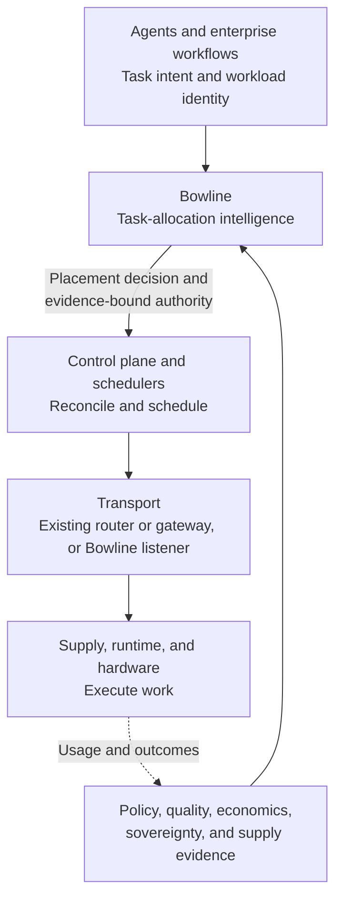
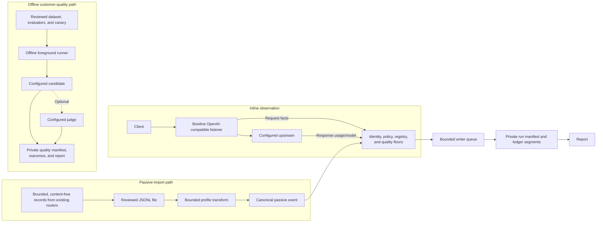

# Architecture

## Logical role in the stack

Bowline is the task-allocation intelligence between the systems that create enterprise AI work and
the execution foundation that carries it out. It consumes task intent and workload identity plus
policy, quality, economics, sovereignty, and supply evidence. It produces an evidence-bound
placement decision or narrowly scoped authority for the control-plane and routing infrastructure
beneath it to enact.

This diagram defines responsibility and system boundaries. It does not claim that Bowline v0.1
already exposes a standalone placement API.

## Current v0.1 deployment

Bowline v0.1 deploys as a single-replica observation and evidence point on an OpenAI-compatible
HTTP path. Shadow is the default: it forwards request and response bytes without routing changes,
evaluates the decision it would make, and writes bounded local evidence off the response path. An
optional strict enforcement bundle can grant exact, fresh Chat/Responses authority. Startup
preserves an existing valid private kill state and never arms authority automatically.

## Components and ownership

- `bowline` composes configuration, preflight, signals, reporting, and operator commands.
- `bowline-gateway` owns byte-faithful proxying, identity extraction, timeouts, health, accounting,
  and the managed writer lifecycle.
- `bowline-core` owns validation, policy, registry, deterministic decisions, run manifests,
  segmented ledgers, recovery, and report computation.

The configured `upstream` is the actual serving path. With no dynamic response-header mapping,
`actual_supply_id` identifies that exact model-and-location registry entry and aliases resolve only
inside it. With a configured response header, Bowline resolves one exact operator-reviewed
`(namespace, value)` mapping. An absent header may use the legacy configured supply; a present
unknown, repeated, malformed, or model-mismatched reference resolves no supply and never falls back.
Passive events require an exact event reference and never use `actual_supply_id` as fallback.
Shadow placement never changes the forwarded destination. Controlled authority uses separate
exact route grants described in [controlled enforcement](controlled-enforcement.md).

## Request and evidence lifecycle

Inline decision evidence supports OpenAI-compatible Chat Completions, Responses, and Embeddings.
Catalogued routes outside the three supported protocols are forwarded unchanged and recorded as
`unsupported-protocol` coverage. Malformed or unsupported request envelopes on supported routes
are recorded as `unsupported-shape` coverage with a reason.

### v1 inference-route catalog

Catalog version 1 consists of these exact method/path contracts:

| Method | Path | Treatment |
| --- | --- | --- |
| `POST` | `/v1/chat/completions` | Supported inline decision evidence. |
| `POST` | `/v1/responses` | Supported inline decision evidence. |
| `POST` | `/v1/embeddings` | Supported inline decision evidence. |
| `POST` | `/v1/completions` | Forward unchanged; record `unsupported-protocol` coverage only. |
| `POST` | `/v1/audio/transcriptions` | Forward unchanged; record `unsupported-protocol` coverage only. |
| `POST` | `/v1/audio/translations` | Forward unchanged; record `unsupported-protocol` coverage only. |
| `POST` | `/v1/audio/speech` | Forward unchanged; record `unsupported-protocol` coverage only. |
| `POST` | `/v1/images/generations` | Forward unchanged; record `unsupported-protocol` coverage only. |
| `POST` | `/v1/images/edits` | Forward unchanged; record `unsupported-protocol` coverage only. |
| `POST` | `/v1/images/variations` | Forward unchanged; record `unsupported-protocol` coverage only. |
| `POST` | `/v1/moderations` | Forward unchanged; record `unsupported-protocol` coverage only. |
| `POST` | `/v1/rerank` | Forward unchanged; record `unsupported-protocol` coverage only. |

Coverage-only records carry no placement recommendation and are excluded from cost, sovereignty,
arbitrage, unplaceable, mapping, and priceability calculations. Reports disclose the gap and remain
incomplete for portfolio-wide conclusions. Administrative/non-inference routes such as models,
files, batches, uploads, and vector-store management are forwarded and are not counted as inference
traffic. Routes absent from catalog version 1 are forwarded and not included in the denominator;
the table above defines the coverage claim.

The local `/health/live`, `/health/ready`, and `/health/status` routes are not forwarded. Bowline
strips hop-by-hop and `x-bowline-*` headers before forwarding. Immediate peer address decides
whether workload identity headers are trusted; forwarded identity is honored only when that peer is
in `trusted_proxy_cidrs`.

Acceptance allocates a run-scoped monotonic sequence before upstream I/O. Completion records actual
model, usage provenance, costs when priceable, policy digest, and the shadow decision. Writer queue
saturation or failure is disclosed as a drop and makes readiness false. The response body remains
unchanged when accounting capture exceeds its bound; the record is marked truncated.

## Passive file intake

`bowline import observations` is an offline command, not a network service. It reads one regular,
non-symlink input file and one regular profile file through bounded descriptors, fully validates
and normalizes them before creating a run, then allocates managed-writer sequences in source-line
order. Event timestamps are preserved even when they are out of order. Duplicate event IDs within
one file fail atomically with line numbers. Cross-run duplicate suppression is not performed.

The canonical version-1 event contains only event ID, timestamp, exact method/path, model,
attribution reference, status, streaming flag, latency, token usage, and enumerated dimensions.
Protocol, policy, placement, cost, identity digest, and coverage are recomputed by Bowline. Prompts,
messages, tool arguments, bodies, arbitrary headers, credentials, raw URLs, imported costs, and
imported placement decisions are not accepted. The compiled ceilings are 16 MiB per input, 16 KiB
per line, and 100,000 events; profile scalar strings and source pointers have lower field-specific
bounds.

Profiles are exact configured output contracts. The shipped LiteLLM example consumes only the
Bowline callback serializer output. The shipped Envoy example consumes only the included typed-JSON
formatter contract with operator-provided dynamic metadata; Envoy does not create model or token
facts. Neither example claims a universal or provider-native log schema.

One deployment represents one enterprise security domain. Dimensions such as application, team,
environment, cost center, route, and task class are report and policy dimensions, not tenants or
authentication boundaries. Passive import stays off the request path and has no routing authority.

## Persistence and integrity

Each process invocation creates one run manifest and segmented append-only ledger. A directory-wide
`writer.lock` rejects concurrent writers. Manifest writes are atomic and mode `0600`; segments
rotate only between complete frames and stop at the configured capacity without deleting evidence.
SIGINT/SIGTERM stops acceptance, drains HTTP work, drains and synchronizes the writer, then marks a
clean shutdown. After a crash, the prior unclean run remains and a new invocation starts a new run.

See [configuration](configuration.md), [security](security.md), [reporting](reporting.md), and
[operations](operations.md).

## Offline customer-quality path

The quality runner is separate from proxy and passive evidence. It prevalidates the complete
dataset manifest, ordered JSONL cases, evaluator file, canary file, optional rubric, policy,
registry, owned-cost inputs, endpoint URLs, and authorization references before run creation.
`canary validate` stops there. `canary run` creates a private quality run and dispatches only the
planned non-streaming Chat or Responses calls.

Candidate normalization and deterministic evaluators run after each bounded response. When
configured, the candidate-to-judge continuation is one in-flight chain under shared global and
separate per-candidate/judge semaphores. There is no retry, live traffic duplication, routing
decision, or registry write. Completion-order outcome writes retain deterministic preassigned
sequence IDs.

Quality evidence uses its own manifest and CRC-framed outcome ledger. A mode-0600 completion report
is atomically stored, then its digest and the canonical sequence-sorted outcome digest are bound
once into the manifest. Stored reporting validates those bindings before recomputing freshness;
verification mode also binds the current operator inputs and remains offline. See
[customer quality evidence](customer-quality.md).

## Offline actionable-economics path

Billing validation/import and economics validation/reporting are foreground offline commands.
Canonical or explicitly mapped billing rows enter a separate framed private store only after full
prevalidation. Economics loads exact named traffic/billing/quality runs, validates every applicable
manifest and source binding, computes one canonical report, then atomically publishes seven static
files. No component calls a provider billing API or changes serving state. See
[actionable economics](actionable-economics.md).

## Controlled request path

For a converted route, trusted identity and exact policy resolution precede deterministic
selection. Bowline flushes one schema-v2 decision before constructing the selected target. A fresh
candidate handle can authorize only its bound actuator, request, workload, grant, and run. Global
then per-actuator permits apply only to candidate traffic. The runtime constructs the original
target, candidate target, or local fail-closed response once; there is no second dispatch.

Candidate bodies preserve the original model or rewrite only the unique top-level model value when
the route explicitly permits canonical rewrite. Original, candidate, and probe clients do not
follow redirects. Candidate failures update volatile circuit state and terminate locally. Public
health derives aggregate route-safe readiness while local CLI diagnostics retain sanitized detail.
